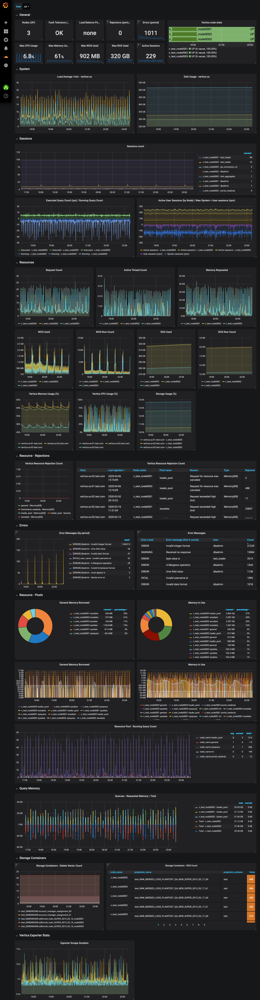

# grafana-vertica
Grafana dashboard for Vertica monitoring using Prometheus (vertica_exporter + telegraf/node_exporter)

## Requirements
vertica-exporter - Use ansible role [`ansible-vertica-exporter`](https://github.com/architector-yt-ru/ansible-vertica-exporter)

grafana-piechart-panel:

```
grafana-cli plugins install grafana-piechart-panel
```

## Metrics
vertica_error_messages_count
vertica_load_balance_policy
vertica_node_node_state_int
vertica_projection_storage_ros_count
vertica_query_active_user_session_count
vertica_query_executed_query_count
vertica_query_running_query_count
vertica_query_total_system_session_count
vertica_query_total_user_session_count
vertica_resource_pool_general_memory_borrowed_kb
vertica_resource_pool_memory_inuse_kb
vertica_resource_pool_running_query_count
vertica_resource_queues_memory_requested_kb_total
vertica_resource_rejections_rejection_count
vertica_resource_usage_active_thread_count
vertica_resource_usage_memory_requested_kb
vertica_resource_usage_request_count
vertica_resource_usage_ros_row_count
vertica_resource_usage_ros_used_bytes
vertica_resource_usage_wos_row_count
vertica_resource_usage_wos_used_bytes
vertica_sessions_count
vertica_storage_containers_delete_vector_count
vertica_storage_usage_usage_percent
vertica_system_current_fault_tolerance

## Dashboard



